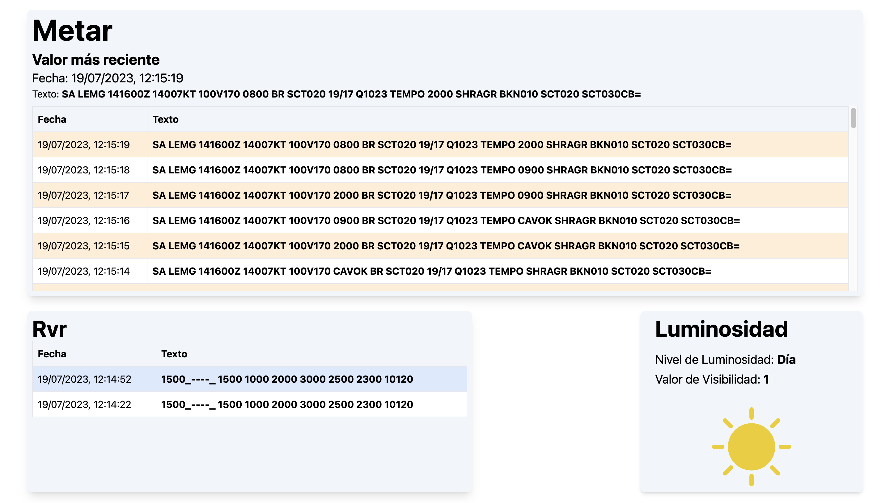

# Interfaz de Estación Meteorológica

Este proyecto ofrece una interfaz gráfica en tiempo real para una estación meteorológica, con React. Obtiene datos de un servicio de backend y muestra información sobre la luminosidad, METAR (Informe meteorológico aeronáutico de rutina) y RVR (Alcance Visual en Pista) de una amigable para el usuario.



## Características

- Obtiene y muestra datos meteorológicos en tiempo real del servicio de backend.
- Muestra niveles de luminosidad con iconos correspondientes.
- Muestra datos de METAR y RVR en un formato tabular, ordenado por fecha y hora.
- Proporciona estados de carga y error amigables para el usuario.

## Comenzando

### Prerrequisitos

Para ejecutar este proyecto, necesitarás tener Node.js instalado en tu ordenador. Puedes descargar Node.js desde https://nodejs.org/.

### Instalación

1. Clona el repositorio:

```bash
git clone https://github.com/tu-nombre-de-usuario-de-github/tablero-estacion-meteorologica.git
```

2. Instala dependencias:

```bash
cd tablero-estacion-meteorologica
npm install
```

3. Ejecuta el projecto:

```bash
npm start
```

## Estructura del Proyecto

- LuminosityDisplay - Componente para mostrar datos de luminosidad.
- MetarDisplay - Componente para mostrar datos de METAR.
- RvrDisplay - Componente para mostrar datos de RVR.
- Tablas - Componente de nivel superior que agrupa los tres componentes anteriores.
- Home - Componente de diseño que muestra el componente Tablas.
- App - Componente raíz de la aplicación. Gestiona la obtención de datos y la provisión de contexto.
